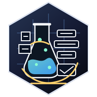

<p align="center">
  
</p>

<p align="center">
  <a href="https://github.com/nshkrdotcom/stack_lab/actions/workflows/ci.yml">
    
  </a>
  <a href="https://github.com/nshkrdotcom/stack_lab/blob/main/LICENSE">
    
  </a>
</p>

# StackLab

StackLab is the proving harness monorepo for the current platform buildout.

It exists to make single-node boot, multi-node boot, fault injection, restart
drills, and end-to-end examples repeatable from one workspace root.

The current proving set covers the active lower seam, the substrate dispatch
owner, and the product-facing northbound surfaces:

- `examples/single_node_roundtrip`
- `examples/lower_facts_roundtrip`
- `examples/outer_brain_restart_durability`
- `examples/mezzanine_restart_recovery`
- `examples/governed_run_roundtrip`
- `examples/semantic_host_roundtrip`
- `examples/typed_host_roundtrip`
- `examples/multi_node_roundtrip`
- `examples/restart_authority_drill`
- `examples/pressure_failover_drill`
- `examples/skill_roundtrip`
- `examples/hive_roundtrip`
- `support/model_inference_scanner`
- `support/optimization_fabric_scanner`
- `support/coordination_fabric_scanner`
- `support/cost_budget_scanner`
- `support/adaptive_control_scanner`
- `support/ai_run_lineage_scanner`
- `support/persistence_matrix_scanner`
- `examples/gepa_platform_roundtrip`
- `examples/trinity_platform_roundtrip`
- `examples/adaptive_control_roundtrip`
- `examples/persistence_mode_roundtrip`

Those examples exercise real `citadel` and real `jido_integration` code
through the harness-only `support/citadel_spine_harness` package. The typed
host proof also assembles real `app_kit` and `citadel_domain_surface` above
the same lower seam. The dedicated OuterBrain restart-durability proof uses
real `outer_brain` persistence, runtime, and restart-authority packages
against backing Postgres. The semantic host proof remains adapter-shaped today
and does not claim that its own path runs through a real `outer_brain`
semantic-runtime surface inside `stack_lab`. The neutral mezzanine restart
recovery proof uses the real execution ledger, JobOutbox-backed dispatch
worker, and runtime-scheduler recovery slice against backing Postgres. The
governed-run proof exercises the current `app_kit -> mezzanine -> citadel ->
jido_integration` control path without product-specific `extravaganza` code.
For substrate-origin commands, that proof uses the Mezzanine substrate ingress
facade and Citadel governance library directly, with a packet reconciliation
gate proving the active path does not use host ingress or host-session
continuity.
The current lower-backed read proofs require tenant-scoped lower facts and
caller-carried lease authorization scope across the `app_kit -> mezzanine ->
jido_integration` path, including negative checks for cross-tenant read and
stream attachment reuse.
Phase 5 adds Scenario 201 for Mezzanine Temporal/Postgres projection drift:
the harness proves compact Temporal describe/query evidence, workflow-start
outbox retirement posture, dispatch-state reduction, and fanout/fanin close
semantics without exporting raw workflow history.
Phase 5 also adds Scenario 203B for the multi-writer state audit profile: the
harness classifies Jido Hive room truth, room event logs, participant presence,
client/worker local state, and context-graph projections into explicit writer
modes, while rejecting OT/CRDT or projection-as-truth claims that lack a source
owner and merge mechanics.
Phase 7 adds `support/memsim_harness` for governed-memory substrate drills,
starting with Scenario 700 for multi-node epoch monotonicity, source-node
attribution, commit-order evidence, AITrace per-node receipt collection,
cluster invalidation observations, and local-only toxiproxy hooks.
Phase 8 adds governed GEPA proof support: model inference boundary scanning,
optimization fabric scanning, adaptive AI run lineage scanning, and a
deterministic `gepa_platform_roundtrip` example over mock model profiles.
Phase 11 adds governed TRINITY proof support: coordination fabric scanning and
a deterministic `trinity_platform_roundtrip` example over mock tenant, router,
role, provider, verifier, trace, and replay refs.
Phase 12 adds prior-fabric cost and budget proof support:
`support/cost_budget_scanner` verifies token, provider request, self-hosted GPU
minute, endpoint startup, eval batch, replay, optimization search, provider
pool, role, promotion, retry, budget exhaustion, AppKit projection, AITrace
span, and StackLab receipt refs without raw payload projection.
Phase 13 adds closed-loop adaptive-control proof support:
`support/adaptive_control_scanner` verifies TRINITY trace refs, eval and replay
dataset refs, GEPA target refs, candidate refs, gate evidence, promotion refs,
rollback refs, stale artifact rejection refs, AppKit projection refs, and
receipt refs. `examples/adaptive_control_roundtrip` proves the deterministic
TRINITY trace to GEPA candidate to gated promotion to rollback loop without
live provider dependencies.
The persistence overlay adds `support/persistence_matrix_scanner` and
`examples/persistence_mode_roundtrip` for deterministic persistence-profile
matrix proof. The harness verifies `:mickey_mouse`, `:memory_debug`, gated
`:integration_postgres`, and `:full_debug_tracked` profile receipts with no
default Postgres, Temporal, object store, live provider, network, or optional
external substrate dependency and with redacted debug facts only. Phase 10
extends the proof so every profile receipt records storage behavior,
authority-semantics, restart-claim, and gn-ten profile/tier/store/capture/proof
fields, and every `PERSIST-001` through `PERSIST-020` fixture maps to source,
test, scanner, docs, and receipt evidence. Scanner inputs are structured facts;
regex parsing, environment reads, live substrate checks, and raw debug payloads
are outside the proof contract.
Phase 16 adds adaptive release-proof mapping in
`support/gn_ten_control_plane`: public claims must map to SpecCells, fixtures,
scanner refs, docs refs, QC refs, and receipt refs before they can be treated
as release evidence. Inherited open defects keep the release status open.
Phase 5 Scenario 209 proves Milestone-7 version-skew and contract-chaos
handling: Citadel invocation requests accept V2 only, malformed/downgraded/
future schema versions and stale schema hashes fail closed, Mezzanine workflow
signals require explicit registered signal versions, and BrainIngress has no
current workflow-bound old-shape intake path without an active-workflow pin.
Phase 5 Scenarios 210, 210A, and 211 prove the Milestone-8 AI-native minimal
seams: context-budget enforcement fails closed at preflight, append, stream,
runtime-admission, and reconciliation loci; cost attribution requires tenant,
authority, lineage, runtime, provider, model, endpoint, and source-meter joins;
semantic failure exports carry structured journal identity, artifact-backed
evidence, redaction refs, bounded reply-publication refs, and denial evidence
for unsafe feedback, training, delimiter, and direct agent-mutation paths.
Phase 3 adds product-boundary release proofs: Scenario 31 runs the AppKit
product no-bypass scanner against `extravaganza`, Scenario 36 separately proves
there is no direct Execution Plane bypass in product/AppKit paths, and Scenario
42 proves a second synthetic connector-automation product shape through the
same AppKit northbound boundary.
Phase 3 also adds the M6 release-readiness proofs: Scenario 38 reconstructs
unified traces from all required hot and archived pivots, Scenario 39 rejects
stale installation revisions under lease activation, Scenario 40 exercises
LifecycleContinuation retry/dead-letter/operator recovery, Scenario 41 proves
archival plus archived-trace lookup, and Scenario 43 proves duplicate-safe
lease and worker fencing behavior.
Scenario 34 currently covers the internal/operator extension authoring path as
a deterministic checksum/schema fixture. Signature verification is not a v1
release claim unless Phase 1 source-verifies signing modules and tests or Phase
7 implements signing; until then, signing cases remain source-verification
required before runtime activation.
Scenario 35 proves operational runbook drift cannot close silently: the harness
checks that every Phase-3 scenario 29-43 names an indexed runbook filename,
that every indexed runbook exists, and that no required runbook remains in
placeholder `[DESIGNED]` state.
The OuterBrain restart-durability proof also carries Phase-3 semantic gateway
coverage: provider-neutral semantic failure carriers are journaled durably,
context adapter requests stay read-only and provenance-preserving, and restart
replay is deduped by reply-publication key.
The Execution Plane node proof now assembles a real lane-neutral node with
explicit process and HTTP lane deps, verified targets, evidence capture, and a
remote-runtime-client stub. It proves local node process/HTTP execution,
rejection of unsigned authority and unattested targets, and the
JidoIntegration-owned fallback ladder that records a rejected strong
attestation rung before succeeding on `local-erlexec-weak`.
The harness also exposes an opt-in provider smoke command from the workspace
root that composes Linear terminal publication, GitHub disposable PR
creation/review/cleanup, Codex app-server execution, Temporal substrate status,
and a local receipt without accepting static provider selectors.

## Scope

- local harness tooling
- distributed-development runbooks
- fault injection scripts
- support packages and example projects
- end-to-end smoke and drill paths

## Development

```bash
mix deps.get
epmd -daemon
epmd -names
mix ci
```

`mix ci` includes remote Spine and restart-authority proofs that start
short-name distributed BEAM nodes through `:peer`. EPMD must be running before
those tests execute; if it is not, the harness can fail while starting the
local distributed node instead of reaching the proof logic.

Workspace package fanout is managed by Blitz. On large local machines the
default StackLab profile keeps package fanout at the configured base values so
remote Spine, restart-authority, and database-heavy harnesses do not starve
each other during `mix ci`. Override temporarily with
`STACK_LAB_MONOREPO_MAX_CONCURRENCY=<n>` when measuring a specific local box.

Proof scenarios must not mutate committed fixtures or leave generated archive
bundles in tracked paths. Harnesses use OS temp roots or ignored generated
directories so a successful `mix ci` also preserves worktree hygiene.

The harness consumes `AppKit.Boundary.NoBypass` directly for product-boundary
packet reconciliation. Product no-bypass and Execution Plane hazmat no-bypass
are separate checks and both must stay green before release-readiness claims are
accepted.
Runbook drift is also executable: `CitadelSpineHarness.exercise_packet_reconciliation(:phase3_runbook_drift)`
must stay green before any Phase-3 release-readiness closeout.

The welded `stack_lab_lab_core` artifact is tracked through the prepared bundle
flow:

```bash
mix release.prepare
mix release.track
mix release.archive
```

`mix release.track` updates the orphan-backed `projection/stack_lab_lab_core`
branch so downstream repos can pin a real generated-source ref before any
formal release boundary exists.

## Runbook

```bash
just up-single
just up-multi
just fault net-cut
```

## Documentation

- [docs/overview.md](./docs/overview.md)
- [docs/development.md](./docs/development.md)
- [docs/layout.md](./docs/layout.md)
- [docs/runbooks/up_single.md](./docs/runbooks/up_single.md)
- [docs/runbooks/up_multi.md](./docs/runbooks/up_multi.md)
- [docs/runbooks/faults.md](./docs/runbooks/faults.md)
- [docs/runbooks/tre_lane_acceptance.md](./docs/runbooks/tre_lane_acceptance.md)
- [support/spec_cell/README.md](./support/spec_cell/README.md)
- [support/gn_ten_control_plane/README.md](./support/gn_ten_control_plane/README.md)
- [support/citadel_spine_harness/README.md](./support/citadel_spine_harness/README.md)
- [support/memsim_harness/README.md](./support/memsim_harness/README.md)
- [examples/atom_cleanup_harness/README.md](./examples/atom_cleanup_harness/README.md)
- [examples/env_remediation_harness/README.md](./examples/env_remediation_harness/README.md)
- [examples/skill_roundtrip/README.md](./examples/skill_roundtrip/README.md)
- [examples/hive_roundtrip/README.md](./examples/hive_roundtrip/README.md)
- [support/model_inference_scanner/README.md](./support/model_inference_scanner/README.md)
- [support/optimization_fabric_scanner/README.md](./support/optimization_fabric_scanner/README.md)
- [support/coordination_fabric_scanner/README.md](./support/coordination_fabric_scanner/README.md)
- [support/cost_budget_scanner/README.md](./support/cost_budget_scanner/README.md)
- [support/ai_run_lineage_scanner/README.md](./support/ai_run_lineage_scanner/README.md)
- [support/persistence_matrix_scanner/README.md](./support/persistence_matrix_scanner/README.md)
- [examples/gepa_platform_roundtrip/README.md](./examples/gepa_platform_roundtrip/README.md)
- [examples/trinity_platform_roundtrip/README.md](./examples/trinity_platform_roundtrip/README.md)
- [examples/adaptive_control_roundtrip/README.md](./examples/adaptive_control_roundtrip/README.md)
- [examples/persistence_mode_roundtrip/README.md](./examples/persistence_mode_roundtrip/README.md)
- `docs/persistence.md`

## License

MIT.

Copyright (c) 2026 nshkrdotcom.

## Temporal developer environment

Temporal runtime development is managed from `/home/home/p/g/n/mezzanine`
through the repo-owned `just` workflow. Do not start ad hoc Temporal processes
or rely on the `temporal` CLI as the implementation runbook.

## Native Temporal development substrate

Temporal runtime development is managed from `/home/home/p/g/n/mezzanine` through the repo-owned `just` workflow, not by manually starting ad hoc Temporal processes.

Use:

```bash
cd /home/home/p/g/n/mezzanine
just dev-up
just dev-status
just dev-logs
just temporal-ui
```

Expected local contract: `127.0.0.1:7233`, UI `http://127.0.0.1:8233`, namespace `default`, native service `mezzanine-temporal-dev.service`, persistent state `~/.local/share/temporal/dev-server.db`.

## Persistence Documentation

See `docs/persistence.md` for tiers, defaults, adapters, unsupported selections, config examples, restart claims, durability claims, debug sidecar behavior, redaction guarantees, migration or preflight behavior, and no-bypass scope when applicable.
